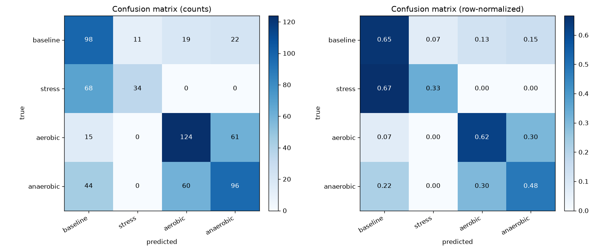
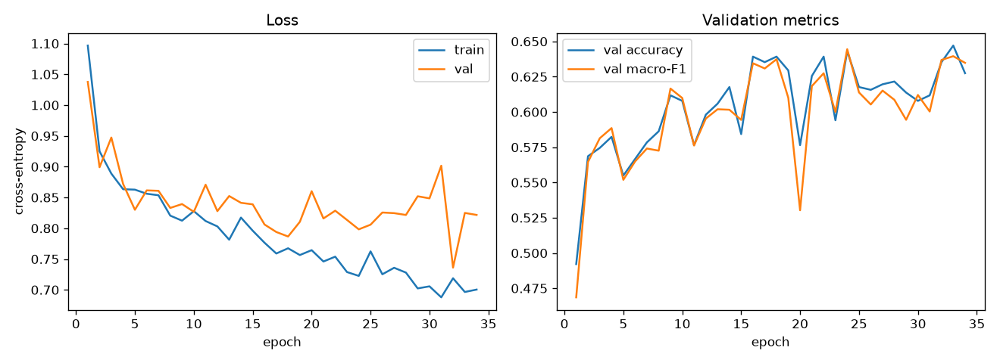

# StressSense: A Deep Learning Pipeline for Wearable Stress Detection under Physical Activity Confounding

A small but complete deep learning system that classifies short windows of
Empatica E4 wristband signals into **baseline**, **mental stress**, **aerobic
exercise**, or **anaerobic exercise**. The point is not just to detect stress,
but to test a specific failure mode: physical activity raises heart rate and
electrodermal activity in ways that can *look* like stress, so can a model tell
genuine mental stress apart from exercise?

`data → preprocessing → windows → 1D CNN → training → evaluation → Gradio demo`

> **Scope.** This is a controlled-lab research prototype, not a medical or
> diagnostic tool. See [Limitations](#limitations).

---

## Problem

Wearables are increasingly used to flag "stress" from physiology (EDA, heart
rate, skin temperature). But exercise produces overlapping responses — elevated
heart rate, sweating — so a naive detector can confuse a workout with a stressful
meeting. This project frames stress detection as a **4-class window
classification** problem that explicitly includes physical activity as competing
classes, and then measures *where the model actually confuses things*.

Concretely, given a 30-second multichannel window, predict one of:

- `baseline` — seated rest before a task/exercise begins
- `stress` — an active mental-stress task (Stroop, mental arithmetic, etc.)
- `aerobic` — graded steady cycling
- `anaerobic` — repeated cycling sprints

**Why it matters.** Separating mental stress from physical exertion is the core
reliability problem for any real wearable stress monitor. Studying the confusion
structure (not just headline accuracy) is what makes the result useful.

## Dataset

**Wearable Device Dataset from Induced Stress and Structured Exercise Sessions**
(PhysioNet v1.0.1) — Empatica E4 recordings from 36 participants across three
session types (STRESS, AEROBIC, ANAEROBIC).

- Source: https://physionet.org/content/wearable-device-dataset/1.0.1/
- Signals per session: EDA (4 Hz), skin temperature (4 Hz), BVP (64 Hz), HR
  (1 Hz, derived from BVP), 3-axis ACC (32 Hz), IBI, and `tags.csv` (button
  presses marking protocol stages).
- Each signal CSV stores the UTC start time in row 0 and the sampling rate in
  row 1.

The dataset is **not redistributed** in this repo (PhysioNet license + size).
Download it, unzip it, and point `data.dataset_root` in `config.yaml` at the
folder that contains `Wearable_Dataset/` and the `Stress_Level_v*.csv` files.

### How labels are derived

The dataset is organized by session type, and `tags.csv` marks the protocol
timeline. The tag→stage mapping is taken directly from the dataset's own
`Wearable_Dataset.ipynb` (its `graph_multiple` shades the stress tasks):

| Class | Where it comes from |
|---|---|
| `baseline` | the `baseline_sec` (default 180 s) of rest just before the first tag of **any** session type |
| `stress` | the documented mental-stress tasks of a STRESS session (V1: Stroop/TMCT/opinion/subtraction; V2 drops Stroop) |
| `aerobic` | first tag → last tag of an AEROBIC session |
| `anaerobic` | first tag → last tag of an ANAEROBIC session |

Drawing `baseline` from all three session types (not only stress days) is
deliberate: it means baseline-vs-exercise and baseline-vs-stress are partly
*within-session* contrasts, which reduces the risk that the model simply learns
"which recording is this" instead of physiology.

Documented data problems (`data_constraints.txt`) are handled explicitly: the
STRESS session for `f07` is excluded (the protection dock covered the PPG and
TEMP sensors), sessions split across connection drops (`f14_a/b`, `S11_a/b`) are
read independently but grouped under one subject, and a STRESS folder with no
tags (`f14_a`) is treated as pure baseline.

## Model

A compact **1D CNN** for multichannel time series (`model.py`):

- Input: `(4, 120)` — 4 channels (EDA, TEMP, HR, ACC motion) × 30 s at 4 Hz.
- 3 conv blocks `Conv1d → BatchNorm → ReLU → MaxPool` with 32 → 64 → 128 filters,
  kernel size 7.
- Global average pooling over time, then a dropout + linear classifier head.
- ~90k parameters.

A 1D CNN fits the data: the discriminative cues are local, translation-invariant
shapes (an EDA rise, sustained vs. spiky motion), which a small CNN learns from a
few thousand windows without the overfitting risk of a larger sequence model.

### Channels and resampling

Signals are sampled at different rates, so each channel is resampled onto a
common 4 Hz grid (`dataset.py`):

- **EDA, TEMP, HR** — linear interpolation onto the grid.
- **ACC** — converted to a *motion-intensity* envelope: take the 3-axis vector
  magnitude (in g) and, per grid bin, its standard deviation. The std removes the
  constant gravity component, leaving how much the wrist is moving — the cue we
  expect to separate seated tasks from cycling.
- **BVP is intentionally not used as a raw channel.** Downsampling a 64 Hz pulse
  waveform to 4 Hz destroys it, so we use Empatica's derived HR instead. A
  separate high-rate BVP branch is listed under future work.

Per-channel standardization statistics are fit on the **training split only** and
stored in the checkpoint, so normalization never leaks across splits.

## Training

```bash
python train.py --config config.yaml
```

- Optimizer Adam (lr 1e-3, weight decay 1e-4), cross-entropy loss.
- **Inverse-frequency class weights** (baseline and stress are minority classes).
- **Subject-level split** (25 train / 5 val / 6 test subjects): every window from
  a subject stays in one split, so the test score reflects generalization to
  *new people*, not memorized individuals.
- Best checkpoint chosen by **validation macro-F1**, with early stopping.
- Training curves and history are saved to `results/`.

Trains in a couple of minutes on CPU.

## Results

Held-out test subjects: `S02, S03, S09, S14, S15, f17` (652 windows).

| Metric | Value |
|---|---|
| Accuracy | **0.54** |
| Macro-F1 | **0.53** |

Per-class (precision / recall / F1):

| Class | Precision | Recall | F1 |
|---|---|---|---|
| baseline | 0.44 | 0.65 | 0.52 |
| stress | 0.76 | 0.33 | 0.46 |
| aerobic | 0.61 | 0.62 | 0.62 |
| anaerobic | 0.54 | 0.48 | 0.51 |




**The interesting part is the confusion structure, not the headline number:**

- **Mental stress is never confused with physical activity** — 0% of stress
  windows are predicted as aerobic/anaerobic, and 0% of exercise windows are
  predicted as stress. The motion channel cleanly separates seated tasks from
  cycling. This is the project's central question, and the answer is clean.
- **The hard confusions are *within* category.** Aerobic and anaerobic (both
  cycling) are mutually confused ~30% of the time. And **stress is mostly
  under-detected**: 67% of stress windows are read as baseline (recall 0.33),
  though when the model *does* say "stress" it is usually right (precision 0.76).
  Mental stress produces subtler physiological changes than exercise, and a
  seated stress window can look a lot like a seated rest window.
- **Easiest class: aerobic (F1 0.62). Hardest: stress (F1 0.46).**

A regenerated, computed narrative lives in
[`results/error_analysis.txt`](results/error_analysis.txt). All numbers above are
produced by `evaluate.py`; nothing here is hand-edited. With only 6 test
subjects, treat absolute values as indicative, not definitive — see Limitations.

## Demo

```bash
python demo.py            # http://127.0.0.1:7860
```

A Gradio app that lets you pick one of the exported example windows (or upload
your own CSV with `EDA,TEMP,HR,ACC` columns), shows the predicted class with
confidence scores, and plots the four biosignals behind the decision. Example
windows are written to `examples/` by `evaluate.py`.

Single-window prediction from the command line:

```bash
python inference.py --input examples/example_stress_1.csv
```

## Reproduce from scratch

```bash
# 1. Environment (CPU is enough)
pip install -r requirements.txt
pip install torch --index-url https://download.pytorch.org/whl/cpu   # if torch is slow/GPU

# 2. Get the data and point config.yaml -> data.dataset_root at it
#    https://physionet.org/content/wearable-device-dataset/1.0.1/

# 3. Build windows -> train -> evaluate -> demo
python dataset.py        # writes data/windows.npz
python train.py          # writes models/best_model.pt + results/
python evaluate.py       # writes metrics, confusion matrix, error analysis, examples/
python demo.py           # interactive demo
```

Everything is driven by `config.yaml` (paths, channels, window size, split
ratios, hyperparameters, random seed) and seeded for reproducibility.

## Repository structure

```
StressSense/
├── data/                  # built window cache (windows.npz, gitignored)
├── notebooks/
│   └── exploration.ipynb  # signal EDA + label-derivation walkthrough
├── models/
│   └── best_model.pt      # trained checkpoint (weights + channels + norm stats + split)
├── results/               # metrics.json, confusion_matrix.png, training_curves.png, ...
├── examples/              # example windows exported for the demo
├── dataset.py             # E4 parsing, tag segmentation, resampling, windowing, split
├── model.py               # 1D CNN
├── train.py               # training loop, class weights, checkpointing
├── evaluate.py            # metrics, confusion matrix, error analysis, example export
├── inference.py           # single-window prediction (CLI + Predictor)
├── demo.py                # Gradio demo
├── config.yaml            # all paths and hyperparameters
├── requirements.txt
└── README.md
```

## Limitations

- **Controlled lab data, few subjects.** 36 participants, one session per
  activity. A test set of 6 subjects has high variance, which is exactly why
  validation and test scores differ (val macro-F1 ≈ 0.64 vs. test ≈ 0.53).
- **Not a clinical or diagnostic tool.** "Stress" here means *performing a
  scripted stress task*, not a clinical state. Real-world stress is more diverse
  and not button-marked.
- **Session-level confounding remains.** Each activity is essentially one
  recording per subject, so some separability could reflect per-session signal
  offsets rather than pure physiology. Sourcing baseline from all session types
  mitigates this but does not remove it.
- **Label granularity.** Stress windows come from the documented task spans;
  inter-task rests inside a stress session are not labeled as stress, and the
  exact task boundaries depend on participant button presses.
- **Motion artifacts.** Wearable signals are noisy and motion-corrupted,
  especially during exercise; EDA/BVP in particular degrade with movement.

## Future work

- Add a separate high-rate **BVP branch** (or HRV features) so cardiac waveform
  information is not discarded.
- **Subject-wise cross-validation** instead of a single split, for stable
  estimates with so few subjects.
- **Per-subject normalization / domain adaptation** to push toward true
  cross-person robustness.
- Distinguish stress sub-tasks, or regress the self-reported stress level
  (`Stress_Level_v*.csv`) instead of a binary stress label.

## CV bullet

> Built **StressSense**, an end-to-end PyTorch pipeline for wearable stress
> detection from multimodal Empatica E4 signals (EDA/HR/TEMP/accelerometer):
> multi-rate signal preprocessing and windowing, a 1D CNN, subject-level
> evaluation with macro-F1 and confusion analysis, and an interactive Gradio
> demo — showing the model cleanly separates mental stress from physical exercise
> while quantifying the harder within-category confusions.

## Acknowledgements / License

Dataset © its PhysioNet authors under the PhysioNet Credentialed/Open license;
see the dataset's `LICENSE.txt`. This repository's code is provided for
educational use.
